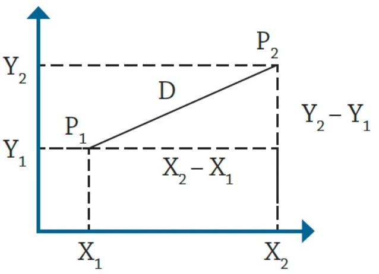
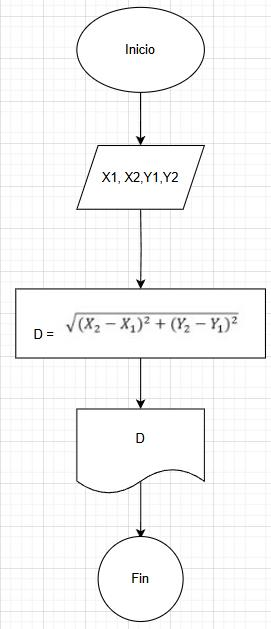
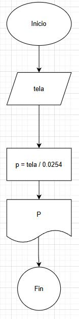
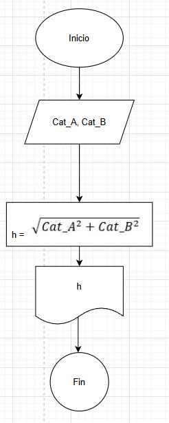

# Instrucciones

Analiza los siguientes ejercicios, para ello utiliza una tabla donde clasifiques las variables de entrada, las de salida y las constantes. Enuncia las ecuaciones involucradas y explique cuál es el análisis o estrategia que utilizará para llegar a la solución del problema.

# Problemas

1. Se requiere obtener la distancia entre dos puntos en el plano cartesiano,
tal y como se muestra en la figura 1. Realice un diagrama de flujo y pseudocódigo
que representen el algoritmo para obtener la distancia entre
esos puntos.



## Pseudocódigo:

```
    Inicio

// Entrada de datos:

    Leer X1, Y1, X2, Y2

// Formula:

D = √(X2-X1)^2 + (Y2-Y1)^2
5. 
Mostar D

    Fin
```

## Diagrama de flujo:




2. Una modista, para realizar sus prendas de vestir, encarga las telas al extranjero.
Para cada pedido, tiene que proporcionar las medidas de la tela
en pulgadas, pero ella generalmente las tiene en metros. Realice un algoritmo para ayudar a resolver el problema, determinando cuántas pulgadas debe pedir con base en los metros que requiere. Represéntelo mediante un diagrama de flujo y pseudocódigo (1 pulgada = 0.0254 m).

## Pseudocódigo:

```
    Inicio

Leer tela
p = tela / 0.0254
Mostrar p

    Fin
```

## Diagrama de flujo:



3. Se requiere determinar la hipotenusa de un triángulo rectángulo. ¿Cómo sería el diagrama de flujo y el pseudocódigo que representen el algoritmo para obtenerla? 
Recuerde que por Pitágoras se tiene que: $C^2 = A^2 + B^2$.

## Pseudocódigo:

```
    Inicio

Leer Cat_A, Cat_B

h = √Cat_A^2 + Cat_B^2

Mostar h

    Fin

```

## Diagrama de flujo:



4. Se requiere determinar la edad actual de una persona basándose en su fecha de nacimiento. Además, es necesario establecer si la persona ya ha cumplido años en el año en curso, si aún no lo ha hecho, o si hoy es su cumpleaños, para celebrarlo. La fecha de nacimiento y la fecha actual estarán representadas mediante tres variables: día, mes y año.
    
    **Instrucciones:**
    
    - Diseñe un algoritmo que permita calcular la edad de la persona.
    - Dentro de la solución, determine si la persona ya celebró su cumpleaños este año o si aún no lo ha hecho.
    - Verifique si la fecha actual corresponde al día de su cumpleaños. De ser así, imprima el mensaje “Feliz Cumpleaños”.
    - Represente la solución utilizando **pseudocódigo** claro y estructurado.


```
Inicio
    Escribir "Ingrese el día de nacimiento:"
    Leer diaNac
    Escribir "Ingrese el mes de nacimiento:"
    Leer mesNac
    Escribir "Ingrese el año de nacimiento:"
    Leer anioNac

    Escribir "Ingrese el día actual:"
    Leer diaAct
    Escribir "Ingrese el mes actual:"
    Leer mesAct
    Escribir "Ingrese el año actual:"
    Leer anioAct

    edad ← anioAct - anioNac

    Si (mesAct < mesNac) o (mesAct = mesNac y diaAct < diaNac) Entonces
        edad ← edad - 1
        cumplio ← "No ha cumplido años aún."
    Sino
        cumplio ← "Ya cumplió años este año."
    FinSi

    Si (diaAct = diaNac) y (mesAct = mesNac) Entonces
        Escribir "Feliz Cumpleaños!"
    FinSi

    Escribir "La edad actual de la persona es: ", edad
    Escribir cumplio
Fin
```


5. Realice un algoritmo que permita determinar el sueldo semanal de un trabajador con base en las horas trabajadas y el pago por hora, considerando que a partir de la hora número 41 y hasta la 45, cada hora se le paga el doble, de la hora 46 a la 50, el triple, y que trabajar más de 50 horas no está permitido. Represente el algoritmo mediante pseudocódigo.

```
    Inicio

    Leer horasTrabajadas
    Leer pagoPorHora

    Si horasTrabajadas > 50 Entonces
        Escribir "No se permite trabajar más de 50 horas."
    SiNo
        Si horasTrabajadas <= 40 Entonces
            sueldoSemanal = horasTrabajadas * pagoPorHora
        SiNo
            horasNormales = 40
            Si horasTrabajadas <= 45 Entonces
                horasExtrasDobles = horasTrabajadas - 40
                sueldoSemanal = (horasNormales * pagoPorHora) + (horasExtrasDobles * pagoPorHora * 2)
            SiNo
                Si horasTrabajadas <= 50 Entonces
                    horasExtrasDobles = 5
                    horasExtrasTriples = horasTrabajadas - 45
                    sueldoSemanal = (horasNormales * pagoPorHora) + (horasExtrasDobles * pagoPorHora * 2) + (horasExtrasTriples * pagoPorHora * 3)
                FinSi
            FinSi
        FinSi

        Escribir "El sueldo semanal es: ", sueldoSemanal
    FinSi

    Fin
```


6. Se requiere un algoritmo para determinar, de N cantidades, cuántas son cero, cuántas son menores a cero, y cuántas son mayores a cero. Realice el pseudocódigo para representarlo, utilizando el ciclo apropiado.

```
    Inicio

    Leer N

    ceros = 0
    menoresCero = 0
    mayoresCero = 0

    Para i = 1 Hasta N Hacer
        Escribir "Ingrese el número ", i, ": "
        Leer cantidad

        Si cantidad = 0 Entonces
            ceros = ceros + 1
        SiNo
            Si cantidad < 0 Entonces
                menoresCero = menoresCero + 1
            SiNo
                mayoresCero = mayoresCero + 1
            FinSi
        FinSi
    FinPara

    Escribir "Cantidad de ceros: ", ceros
    Escribir "Cantidad de números menores a cero: ", menoresCero
    Escribir "Cantidad de números mayores a cero: ", mayoresCero

    Fin
```

7. Se requiere un algoritmo para determinar cuánto ahorrará en pesos una persona diariamente, y en un año, si ahorra 3$ el primero de enero, 9$ el dos de enero, 27$ el 3 de enero y así sucesivamente todo el año. Represente la solución mediante pseudocódigo.

```
    Inicio

    ahorroAnual = 0

    Para dia = 1 Hasta 365 Hacer
        ahorroDiario = 3 * (3 ^ (dia - 1)) / 100  // Cálculo del ahorro diario en pesos
        ahorroAnual = ahorroAnual + ahorroDiario
    FinPara

    Escribir "Ahorro total en un año: $", ahorroAnual

    Fin

```

8. Realice el algoritmo para determinar cuánto pagará una persona que adquiere N artículos, los cuales están de promoción. Considere que si su precio es mayor o igual a $200 se le aplica un descuento de 15%, y si su precio es mayor a $100, pero menor a $200, el descuento es de
12%; de lo contrario, solo se le aplica 10%. Se debe saber cuál es el costo y el descuento que tendrá cada uno de los artículos y finalmente cuánto se pagará por todos los artículos obtenidos. Represente la solución mediante pseudocódigo.


```
    Inicio

    Escribir "Ingrese la cantidad de artículos (N): "
    Leer N

    totalAPagar = 0

    Para i = 1 Hasta N Hacer
        Escribir "Ingrese el precio del artículo ", i, ": "
        Leer precioArticulo

        Si precioArticulo >= 200 Entonces
            descuento = precioArticulo * 0.15
        SiNo
            Si precioArticulo > 100 Entonces
                descuento = precioArticulo * 0.12
            SiNo
                descuento = precioArticulo * 0.10
            FinSi
        FinSi

        costoArticuloConDescuento = precioArticulo - descuento
        totalAPagar = totalAPagar + costoArticuloConDescuento

        Escribir "Artículo ", i, ":"
        Escribir "  Precio original: $", precioArticulo
        Escribir "  Descuento: $", descuento
        Escribir "  Precio con descuento: $", costoArticuloConDescuento
    FinPara

    Escribir "Total a pagar por todos los artículos: $", totalAPagar

    Fin

```

9. Realice un algoritmo y represéntelo mediante pseudocódigo para obtener una función exponencial, la cual está dada por:
    
    $𝑒^𝑥 = 1+\frac x {1!} + \frac {x^2}{2!}+ \frac {x^3}{3!}+ …$


```
Inicio

    Escribir "Ingrese el valor de x:"
    Leer x
    Escribir "Ingrese el número de términos:"
    Leer n

    resultado ← 1
    termino ← 1

    Para i desde 1 hasta n - 1 hacer
        termino ← (termino * x) / i
        resultado ← resultado + termino
    FinPara

    Escribir "El valor aproximado de e^x es: ", resultado

Fin
```

10. Realice un algoritmo para obtener el seno de un ángulo y represéntelo mediante pseudocódigo. Utilice la siguiente ecuación:
$Sen x = x - \frac{x^3}{3!} + \frac{x^5}{5!} - \frac{x^7}{7!} + ...$


```
Inicio
    Escribir "Ingrese el valor de x en radianes:"
    Leer x
    Escribir "Ingrese el número de términos:"
    Leer n

    resultado ← x
    termino ← x
    signo ← -1

    Para i desde 1 hasta n - 1 hacer
        termino ← (termino * x * x) / ((2 * i) * (2 * i + 1))
        resultado ← resultado + (signo * termino)
        signo ← signo * -1
    FinPara

    Escribir "El valor aproximado de sin(x) es: ", resultado
Fin

```
