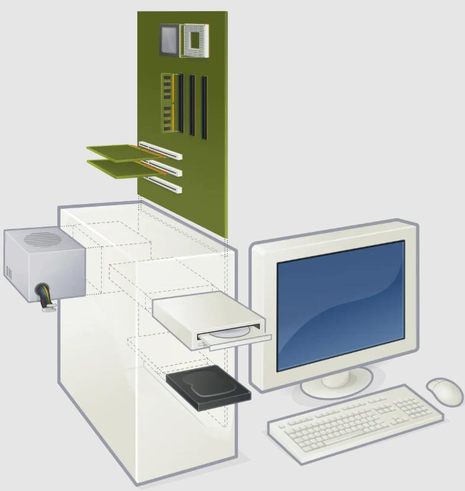
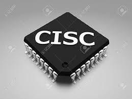
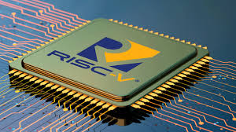
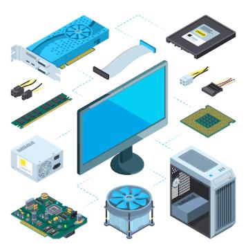
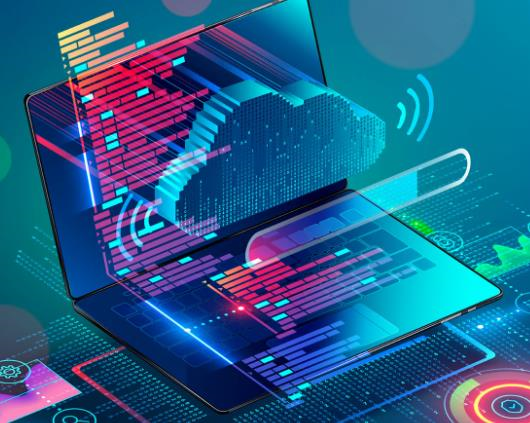
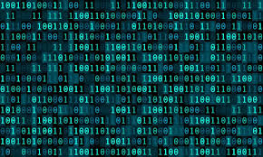

# **¿Qué es un computador?**

#### Un computador es un dispositivo informático que es capaz de recibir, almacenar y procesar información a altas velocidades, la información debe estar debidamente codificada en BITS (Binary Digit).El término computador se utiliza para enfatizar que, en realidad, son dos partes distintas: Hardware y Software Siendo el hardware el computador en sí, es decir, su carcaza, materiales, componentes, pantalla, etc. Siendo el software los programas que ejecutan las tareas.

###### fuentes: 
- https://issuu.com/raidymejiavega/docs/unidad_5_qu_es_una_computadora/s/12530908 
- https://concepto.de/computadora/ 
- https://www.uv.es/afuertes/Informatica/ficheros/tema1_TI.pdf

# **Arquitectura del computador** 

#### La arquitectura de una computadora es la organización lógica del hardware de los computadores. Se trata de un conjunto de principios que describen cómo interactúan sus componentes principales 

### **Componentes principales de la arquitectura:**

- #### CPU: Es la unidad central de procesamiento. Esta parte se encarga de ejecutar las instrucciones y los datos que el software emplea para su ejecución.
- #### Buses de datos y control:  Conectan los componentes y permiten la comunicación entre ellos
- #### Memoria Principal: es la memoria RAM, donde se guardan los procesos que se ejecutan, es decir, datos, instrucciones, etc.
- #### Dispositivos de entrada y salida: Permiten la interacción con el usuario y el computador

### **Tipos de arquitectura:**

- #### Arquitectura Von Neumann:  Usa una memoria unificada para datos e instrucciones, se encuentra en servers y computadores actuales.

- ####  Arquitectura Harvard: Separa memoria de datos e instrucciones para mayor eficiencia, tiene dos memorias separadas, una para las instrucciones del programa y la segunda para procesar los datos, se usa en microcrontroladores.

 
###### fuente:
-  https://www.profesionalreview.com/2022/10/01/arquitectura-de-computadoras/

# Arquitectura CISC

Es una arquitectura de procesadores que utiliza un conjunto de instrucciones complejo y variado, permitiendo ejecutar operaciones complejas en una sola instrucción, aunque requiera múltiples ciclos de reloj, se usa en procesadores INTEL y AMD

- #### Utiliza un conjunto de instrucciones complejo y variado, donde cada instrucción puede realizar múltiples operaciones en un solo ciclo.

- #### Diseñado para reducir la cantidad de instrucciones en un programa, aunque cada una puede tardar varios ciclos en ejecutarse.

###### fuente:
- https://www.profesionalreview.com/2021/07/18/risc-vs-cisc/

# Arquitectura RISC

Es una arquitectura de procesadores basada en un conjunto reducido y optimizado de instrucciones simples, diseñadas para ejecutarse en un solo ciclo de reloj, este enfoque simplifica la decodificación de instrucciones y permite una ejecución más rápida

- #### Para ejecutar una instrucción en estos procesadores se requiere un ciclo de reloj. Cada ciclo incluye un método de obtención, decodificación y ejecución de la instrucción

- #### La técnica de canalización se usa en esta arquitectura para ejecutar múltiples partes o etapas de instrucciones para obtener un funcionamiento más eficiente

###### fuente: https://www.profesionalreview.com/2021/07/18/risc-vs-cisc/

# ¿Qué es el hardware?

#### El hardware es el conjunto de componentes fisicos que conforman un computador, por lo tanto, proporciona la estructura y los componentes necesarios para que el software funcione y el usuario pueda interactuar con el sistema.

1. #### CPU: es el componente principal de hardware que se encarga de procesar y ejecutar las instrucciones de los programas. Esencialmente, la CPU toma los datos de entrada, los procesa y produce una salida.
- #### ALU: Es donde se realizan las operaciones matemáticas y lógicas
- #### Unidad de control: Dirige el flujo de datos e instrucciones entre la memoria y la unidad de procesamiento
- #### Registros: Almacenan temporalmente datos, instrucciones y direcciones de memoria que la CPU necesita para trabajar.
- #### Bus: sistema digital que permite la transferencia de datos entre los componentes de un computador

2. #### GPU: La GPU es un componente especializado que se encarga de procesar y renderizar imágenes, videos y otros contenidos visuales en tu computador. Su función principal es liberar a la CPU de estas tareas, permitiendo que el sistema funcione de manera más fluida y eficiente. Su arquitectura se basa en miles de núcleos más pequeños y eficientes que trabajan en conjunto para acelerar el procesamiento gráfico. En comparación con la CPU, que se enfoca en tareas secuenciales y de propósito general, la GPU se especializa en el procesamiento paralelo de datos visuales. Esto significa que puede realizar múltiples operaciones matemáticas y lógicas al mismo tiempo, es decir, un rendimiento superior en aplicaciones gráficas

3. #### Memoria: almacena y recupera datos e instrucciones de manera temporal o permanente.

- #### Registros: Almacenan temporalmente datos, instrucciones y direcciones de memoria que la CPU necesita para trabajar

- #### Cache: Es un tipo de memoria de alta velocidad que se utiliza para almacenar datos a los que la CPU accede con frecuencia.

- #### Principal (RAM): Es la memoria principal de un dispositivo almacena de forma temporal los datos de los programas que estás utilizando en ese momento. Los datos sólo se almacenan de forma temporal, esto quiere decir que cada vez que reinicies o apagues tu computador, los datos que haya almacenados en la RAM se pierden.

4. #### Dispositivos de entrada y salida: Los dispositivos de entrada y salida permiten la comunicación entre el usuario y el computador, siendo los de entrada los que envian información al computador y los dispositivos de salida permiten que el computador envie información al usuario.

5. #### Buses de datos: Los buses de datos son canales de comunicación que permiten la transferencia de información entre los componentes del sistema.

6. #### Tarjeta Madre: Es la tarjeta de circuitos que interconecta todo: hardware, fuente de alimentación y tarjetas gráficas.

7. #### Fuente de poder: Las fuentes de poder sirven para brindar el suministro de energía a cada componente del sistema

8. #### Perifericos: Los periféricos son un conjunto de dispositivos electrónicos físicos que, sin pertenecer al núcleo fundamental de la computadora, formado por la CPU y la memoria central, permitan realizar operaciones de entrada/salida (E/S) complementarias al proceso de datos que realiza la CPU.

###### fuentes:
- https://www.xataka.com/basics/memoria-ram-que-sirve-como-mirar-cuanta-tiene-tu-ordenador-movil
- https://www.datacamp.com/blog/cpu-vs-gpu
- https://www.crucial.mx/articles/pc-builders/how-to-build-a-computer
- https://sdindustrial.com.mx/blog/fuentes-de-poder/#:~:text=Las%20fuentes%20de%20poder%20sirven,dispositivos%20que%20se%20conectan%20por
- https://www.juntadeandalucia.es/educacion/cga/mediawiki/index.php/Perif%C3%A9ricos

# ¿Qué es el software?

#### El software es la parte intangible de un computador, se diferencia del hardware, que es la parte física.  El software abarca todos los programas, aplicaciones y datos que permiten que el hardware funcione y realice tareas específicas, además, puede utilizarse para gestionar datos, automatizar procesos y crear aplicaciones o productos informáticos.

##  Software de sistema

Son los programas que gestionan y controlan los recursos del hardware y permiten la interacción con el usuario, por ejemplo, el sistema operativo.

## Software de aplicación

Son los programas diseñados para realizar tareas específicas para el usuario final, por ejemplo, editores de texto como Word, navegadores como Google, etc.

## Software de desarrollo

Herramientas utilizadas para crear otros programas y aplicaciones. Incluye compiladores, editores de código, depuradores e intérpretes, por ejemplo, Visual Studio Code.

###### fuentes:

- https://www.arimetrics.com/en/digital-glossary/software
- https://www.taclia.com/en-us

# Funcionamiento del computador:

### 1. ¿Qué procesos se llevan a cabo cuando se enciende una computadora?

 - #### POST (Power-On Self-Test): La computadora realiza una serie de comprobaciones automáticas para verificar que todos los componentes de hardware (memoria RAM, disco duro, teclado, etc.) estén funcionando correctamente.
- #### Carga del BIOS: El BIOS (Basic Input/Output System) es un firmware (software básico) almacenado en la placa madre que se encarga de inicializar el hardware y cargar el sistema operativo.
- #### Carga del sistema operativo: El sistema operativo (Windows, macOS, Linux, etc.) se carga desde el disco duro a la memoria RAM. 
- #### Carga de controladores: Se cargan los controladores (drivers) que permiten al sistema operativo comunicarse con los dispositivos de hardware (tarjeta gráfica, tarjeta de sonido, etc.).
- #### Inicio de aplicaciones: Se cargan las aplicaciones que se inician automáticamente al encender la computadora.

### 2. ¿Qué sucede desde que ingreso un dato a través del teclado, hasta que veo el resultado de la operación en la pantalla?

- #### Entrada de Datos: Al presionar una tecla, se envía una señal eléctrica al controlador del teclado, que la traduce en un código binario específico.
- #### Procesamiento: La CPU recibe los datos, los procesa y realiza las operaciones necesarias.
- #### Salida de Datos: El resultado del procesamiento se envía al sistema operativo, que lo transmite al controlador de la tarjeta gráfica. Este controlador convierte la información en señales que se envían al monitor.

### 3. ¿Cómo se codifican los datos internamente en el computador?

las computadoras utilizan el sistema binario para representar y procesar datos. Esto implica que toda la información se codifica en secuencias de bits (dígitos binarios: 0 y 1), cada dígito binario se denomina bit. Los bits se combinan para formar unidades de información más grandes

### 4. ¿Cuáles son las unidades de medida de datos en un computador? Bit, Byte, etc.

- #### Bit: La unidad más pequeña de información, que puede tener un valor de 0 o 1.
- #### Byte: Equivale a 8 bits y puede representar 256 valores diferentes.

A partir de estas unidades básicas, se definen múltiplos para representar cantidades mayores de datos:

- #### Kilobyte (KB): 1,024 bytes.

- #### Megabyte (MB): 1,024 KB.

- #### Gigabyte (GB): 1,024 MB.

- #### Terabyte (TB): 1,024 GB.

- #### Petabyte (PB): 1,024 TB.

###### fuentes:
- https://www.icarito.cl/2009/12/70-4041-9-como-funcionan-los-computadores.shtml/

- https://ocw.bib.upct.es/pluginfile.php/7809/mod_resource/content/1/031_040_capitulo_3_CODIFICACION_INTERNA_DE_LA_INFORMACION.pdf

-  https://www.fing.edu.uy/tecnoinf/mvd/cursos/arqcomp/material/teo/arq-teo02.pdf

# Cuadro conceptual: 

